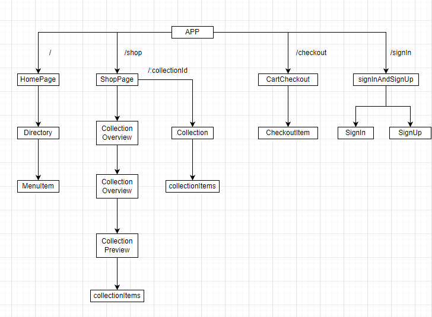

# Crown Clothing 
**[crown-clothing](https://crown-clothig.herokuapp.com/)** is a e-commerce type platfrom which is integrated with firebase and stripe third party fucntion.

## Main Structure

## Main Tech Stack

- [x] **[React](https://reactjs.org/docs/hooks-intro.html)**, using the the lastest React Hooks
- [x] **[Redux Saga](https://redux-saga.js.org/docs/introduction/GettingStarted)** 
- [x] **[Reselect](https://github.com/reduxjs/reselect)**
- [x] **[Redux Persist](https://github.com/rt2zz/redux-persist)**
- [x] **[Firebase](https://firebase.google.com/)**
- [x] **[Stripe](https://stripe.com/docs/testing#testing-interactively)**

## Payment Card Number

When testing interactively, use a card number, such as 4242 4242 4242 4242. Enter the card number in the Dashboard or in any payment form.

- Use a valid future date, such as 12/34.
  
- Use any three-digit CVC (four digits for American Express cards).
  
- Use any value you like for other form fields.